

# Klimakrise, Artensterben  - global denken, lokal handeln (5')?
## 

::: notes :::

Es gibt ganz spezifische und lokale Gründe dafür, sich für den Erhalt eines kleinen waldgebietes einzusetzen, wie das die meisten hier gerade tun. Diese Gründe hängen mit dem lokalen Besonderheiten zusammen, damit was das Waldgebiet zu unserer Lebensqualität beiträgt. Es gibt auch globale Gründe, sich dafür einzusetzen, dass jedes bisschen der verbliebenen Biodiversität erhalten bleibt, weil die weitere Zerstörung der Biodiversität eine globale Katastrophe hervorrufen kann. In unserem Vortrag und bei der Diskussion danach wollen wir diese beiden Ebenen miteinander verbinden und uns erst vom Lokal zum regionalen und globalen bewegen und dann wieder zum Lokal zurückkommen. Es geht dabei darum, uns selbst darüber bewusst zu werden, warum wir uns für den Erhalt von Natur einsetzen Argumente dafür zu finden, um diese Haltung auch zu propagieren und auch zu überlegen mit welchen Gruppen und Bewegung wir uns verbinden können, weil wir eine politische Auseinandersetzung führen, die auf die Region bezogen ist, die aber nicht nur regional gewonnen werden kann.

Wir wollen heute auf den Zusammenhang der Entwicklung in Wundschuh eingehen. Einerseits geht es dabei um die Prozesse, in dieser Konflikt gehört, und andererseits um die Bedeutung eines naturnahen Ökosysteme für das Überleben in einer Zeit ökologischer Krisen. Wir wollen motivieren und Argumente vorschlagen.

:::

## Wer sind wir?

{.portrait}

{.portrait}

# Wald vs. Kiesgrube (10')
## Biodiversität im Wald

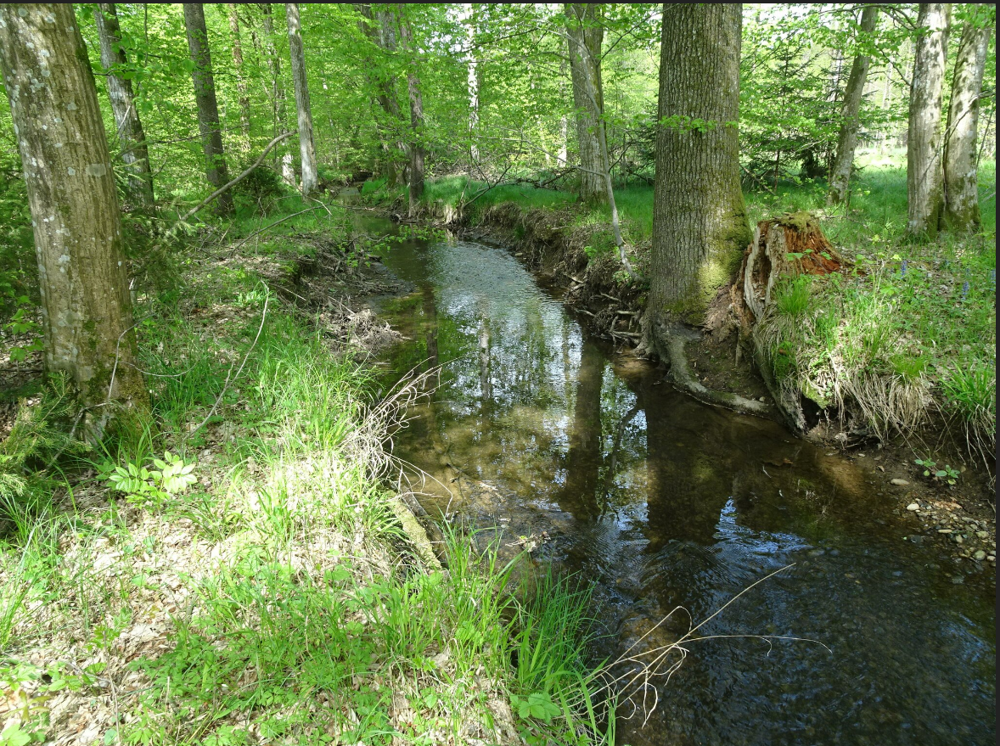

##

## 

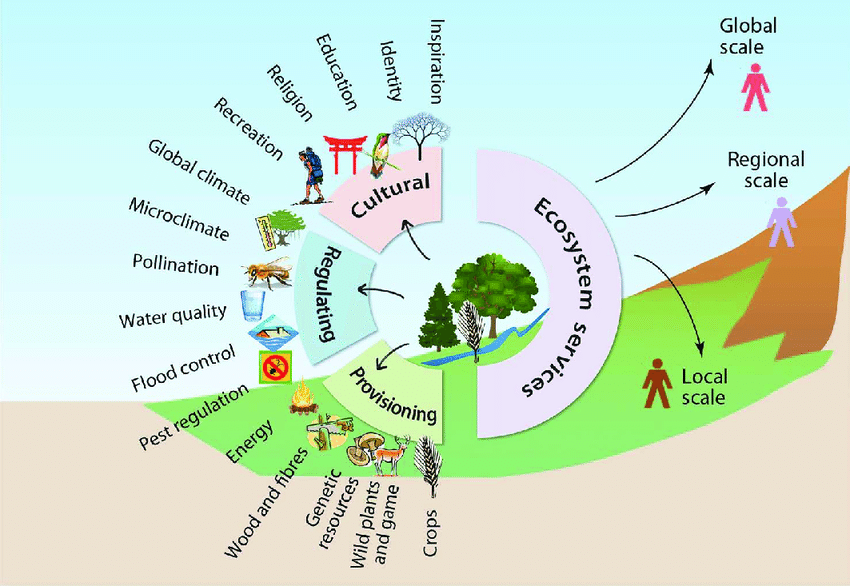

Quelle: @caronLivingTerritoriesTransform2017, p.107 

> **Faustformel**: Ein Hektar Wald “speichert” pro Jahr über alle Altersklassen hinweg ca. 6 Tonnen CO2. Ein Festmeter bzw. ein Kubikmeter Holz hat rund 1 Tonne CO2 “gespeichert”. (Der Begriff “speichern” ist chemisch nicht richtig – siehe Fotosynthese). 

Quelle: [Wie viel Kohlendioxid (CO2) speichert der Wald bzw. ein Baum](https://www.wald.de/waldwissen/wie-viel-kohlendioxid-co2-speichert-der-wald-bzw-ein-baum/ "Wie viel Kohlendioxid (CO2) speichert der Wald bzw. ein Baum") 

##
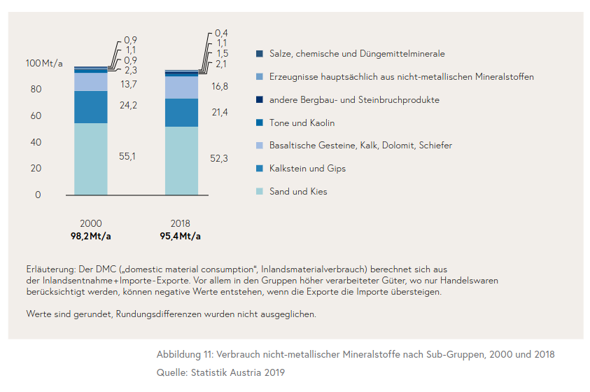

Quelle: @bundesministeriumfuerklimaschutzumweltenergiemobilitaetinnovationundtechnologiebmkRessourcennutzungOesterreich20202020, p. 34

##

> Die Projektionen zeigen, dass große Maßnahmen gefordert sind; es müssten alle bisher bekannten Optionen ausgeschöpft werden. Gut die Hälfte des Ressourcenverbrauchs sind nicht-metallische Mineralstoffe, die für den Aufbau und Erhalt unserer Bestände verwendet werden. Hinzu kommt, dass Sand, Kies, Steine zwar bisher im Übermaß vorhanden waren, aber durch die große Nachfrage, die zunehmend knappen Flächen ebenso wie die Qualität der Kornstruktur zu einem knappen Gut werden. Würden wir also unsere Bestände verändern, könnten wir den Verbrauch der nicht-metallischen Mineralstoffe reduzieren. 

##

> Laut dem Weltklimarat gehen drei Milliarden Tonnen CO2 jährlich allein auf die Produktion von Zement zurück. Das sind bis zu zehn Prozent des vom Menschen ausgestoßenen Treibhausgases. Die Welt müsste weg vom Beton und das schnell. Das Gegenteil ist der Fall. Zwischen 2011 und 2013 wurde in China so viel Beton hergestellt und verbaut wie in der Geschichte der Vereinigten Staaten insgesamt. Die Welt ist so süchtig nach Beton wie nie zuvor. Dabei gibt es Visionäre, die das Problem erkannt haben und die das Bauen mit Beton derzeit neu erfinden wollen. 

Quelle: [Klimasünder Beton - Ein Baustoff sucht Nachfolger](https://www.deutschlandfunk.de/klimasuender-beton-ein-baustoff-sucht-nachfolger-100.html "Klimasünder Beton - Ein Baustoff sucht Nachfolger") 

::: notes :::

Wir haben eben zwei Bilder gesehen, eines, das einen naturnahen Wald zeigt und tatsächlich hier im kaiserwald in der Nähe von Wundschuh aufgenommen worden ist und eines, dass die jetzige schottergruppe der Firma gerade zeigt, übrigens ein werbefoto der Firma, die den Bagger geliefert hat mit dem diese Grube arbeitet.

Für die Frage nach dem lokalen Handeln ist es wichtig zu überlegen, was die Natur, die wir in dem Bild vom Wald sehen, Lokal bedeutet. Welche Dienstleistung, um es so zu nennen, können wir von ihr erwarten, etwas besser formuliert: welche Beiträge? Der erste Beitrag, der oft unterschlagen wird, zeigt sich genau in diesen Bildern Punkt er ist, wenn man so will, ein ästhetischer: es ist angenehm sich in der Natur oder in der Nähe von Lebewesen aufrecht zu erhalten, man fühlt sich dort wohl Punkt man fühlt sich dort vor allem wohl, wenn die Natur nicht unterbrochen ist, sondern wenn das was man sieht teil eines größeren Zusammenhangs, einer Landschaft ist. Das ist kein materieller wert Punkt aber genau diese ästhetische Qualität der Natur, ist der Grund dafür Komma dass wir uns in unserer Freizeit, und vor allem auch im Urlaub, meist gerne in der Natur aufhalten.

Den Wert, denn diese ästhetischen Qualitäten der Natur darstellen, kann man nicht adäquat erfassen, wenn man ihn mit wirtschaftsleistungen vergleicht Punkt es geht hier nicht um Produktion, sondern um das, was man in der Ökonomie oft Reproduktion nennt Punkt ohne diese Reproduktion gibt es keine Produktion und die Reproduktion ist nicht einfach eine Leistung von Menschen, sondern zu ihr gehören viele, sogenannte natürliche und nicht ökonomisch gemessene Vorgänge. Ich stelle das hier an den Anfang, weil man nicht für die Erhaltung eines waldgebiets argumentieren kann, jedenfalls nicht ausreichend, wenn man es rein ökonomisch bewertet. Der wird nicht eben genau darin, das ist sich nicht einfach um etwas ökonomisches handelt.

Über diesen ästhetischen Wert hinaus, aber in Verbindung damit, leistet dieses Waldgebiet viel für unsere Gesundheit. Es trägt nicht nur dazu bei, dass die Luft sauber ist, dass das Wasser in unserer Nähe ausreichend zur Verfügung steht und die Temperaturen geregelt werden, es sorgt auch dafür Komma dass Schädlinge nicht überhand nehmen Punkt es ermöglicht uns, uns zu bewegen Punkt und es ermöglicht uns auch, die Natur zu verstehen und andere, z.b unsere Kinder, in sie einzuführen. Wir können entspannen, und wir können uns auch relativ zwanglos mit anderen treffen. Die Naturräume sind auch soziale Räume. Je weniger diese Räume unterbrochen werden desto weniger Stress wird auf uns ausgeübt.

:::

## Verwendung von Schotter

[Prognose: Umsatz der Branche Kies-, Sand-, Ton- und Kaolingewinnung in Österreich von 2012 bis 2018 und Prognose bis zum Jahr 2025 (in Millionen Euro) | Statista](https://de.statista.com/prognosen/403762/kies-sand-ton-und-kaolingewinnung-umsatz-in-oesterreich "Prognose: Umsatz der Branche Kies-, Sand-, Ton- und Kaolingewinnung in Österreich von 2012 bis 2018 und Prognose bis zum Jahr 2025 (in Millionen Euro) | Statista")

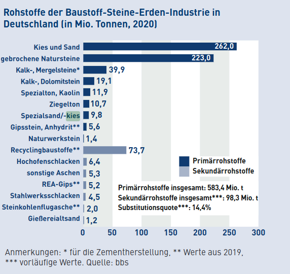

Quelle: @bundesverbandbaustoffe-steineunderdene.v.BBSZahlenspiegel20222022 

##

> Das weltweite Bevölkerungswachstum und die damit verbundene voranschreitende Urbanisierung fordern immer größere Mengen an Baustoffen, wie Beton oder Asphalt. Für die Herstellung dieser bedarf es in einem großen Umfang Bausande, -kiese und Schotter. China, das wie kein anderes Land der Welt von immer größeren Städten und Metropolregionen geprägt ist, produzierte im Jahr 2020 rund 20,4 Milliarden Tonnen der dargestellten Rohstoffe. Wenn auch noch weit abgeschlagen, belegte im internationalen Vergleich Indien den zweiten Platz. Europa folgte anschließend mit einer Produktion von rund 2,9 Milliarden Tonnen.  
> Wie die Statistik verdeutlicht, wird die Produktionsmenge bis zum Jahr 2022 in nahezu sämtlichen Ländern, die abgebildet wurden, ansteigen. Diese Entwicklung verdeutlicht die global immer weiter ansteigende Nachfrage nach den unscheinbaren Rohstoffen.

::: notes :::

Demgegenüber zeigt und das Bild der Kiesgrube ein Beispiel der industriellen Nutzung von Natur. Bei dieser industriellen Nutzung, wird ein erheblicher Teil, nämlich die Pflanzen die Tiere und das, was sie zu ihrem Überleben brauchen, entfernt Punkt es wird Material für industrielle Prozesse gewonnen, bei Schotter nämlich für industrielles Bauen und ganz besonders für das Bauen von Straßen. Die Anlage einer Schottergrube ist eine Investition, durch sie bekommt das Land einen materiellen Wert, und diese Investition lohnt sich vor allem für die Investoren. Ob irgendjemand in der Nähe der Natur, die durch diese Investition zerstört wird, davon profitiert, ist ungewiss. Der Abbau von Schotter in industriellem Ausmaß ist für die Menschen, die hier in der Nähe leben, und deren Arbeitsplätze auch nicht von dieser Schotterproduktion abhängen, kein Vorteil. Die Schottergrube dient primär dazu, dass sich Kapital rentiert, und sie trägt dazu bei dass dieses Kapital weiter zunimmt. Man spricht von der Akkumulation des Kapitals. Wenn man etwas googelt, stellt man fest, dass es bei der Schotterproduktion in unserer Region Konzentrationen gibt, das also tatsächlich das investierte Kapital zunimmt. Man spricht da von den sogenannten schotterbaronen.

:::
## Lokale Beiträge der Natur

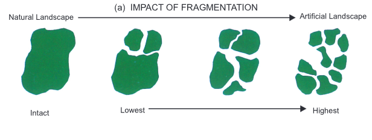
Quelle: @sudhakarreddyBiodiversityCharacterisationLandscape2011 

##

##

Bevölkerungsentwicklung Wundschuh
 

Quelle: [Wundschuh – Wikipedia](https://de.wikipedia.org/wiki/Wundschuh "Wundschuh – Wikipedia") 

##
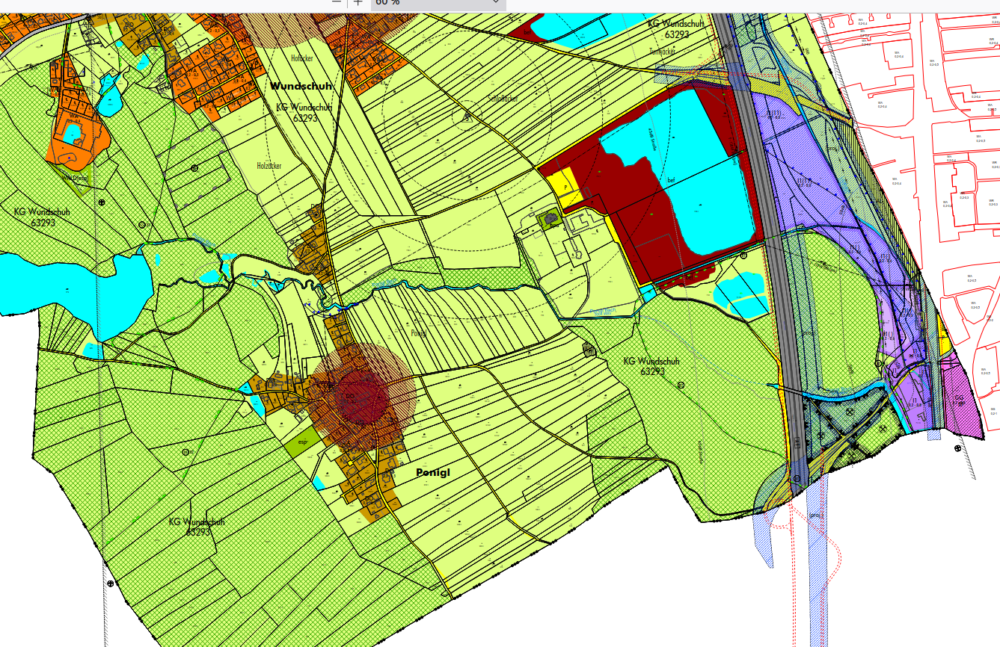

Quelle: [Wundschuh - RiS-Kommunal - Startseite - Umwelt und Wohnen - Flächenwidmungsplan](http://www.wundschuh.at/Umwelt_und_Wohnen/Flaechenwidmungsplan "Wundschuh - RiS-Kommunal - Startseite - Umwelt und Wohnen - Flächenwidmungsplan")

 <https://www.google.com/maps/@46.9147714,15.466161,789m/data=!3m1!1e3?hl=de&entry=ttu>

##
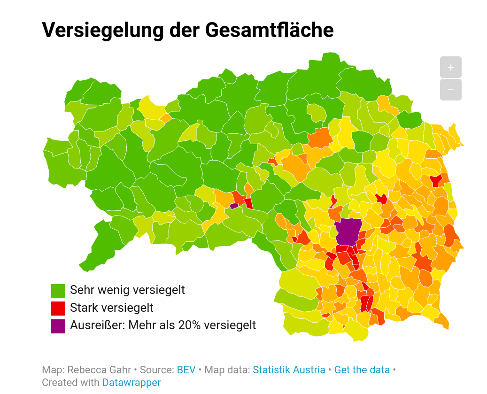

[Die Steiermark verliert den Boden unter den Füßen – DATABLOG](http://datablog.fh-joanneum.at/2020/die-steiermark-verliert-den-boden-unter-den-fuessen/ "Die Steiermark verliert den Boden unter den Füßen – DATABLOG")

::: notes :::

In einem ersten Schritt möchte ich jetzt versuchen, über das lokale hinauszugehen und zwar auch auf der einen Seite für ein Waldstück, wie wir es auf dem Foto gesehen haben und auf der anderen Seite für die schottergrube, die an seiner Stelle errichtet werden soll. Absatz

Man spricht oft von Biotopen und erweckt damit den Eindruck, dass man ein Stück Natur ausschneiden kann, und das dann in ihm für die Lebewesen eine Gemeinschaft bilden die sich selbst reguliert. Grundsätzlich ist das richtig, weil es eine Vielfalt von oder eine Vielzahl von Wechselbeziehungen gibt und in einem bestimmten Raum schon so etwas wie ein in sich geschlossenes System besteht. Diese Systeme sind aber nicht so abgeschlossen, dass sie sich einfach selbst erhalten können. Sie haben eine Vielzahl von Beziehungen nach außen, und sie brauchen ihren Umraum, um existieren zu können Punkt in unserem Fall gibt es hier Arten, die wiederum mit anderen Arten in Beziehung stehen oder auch mit Angehörigen derselben Art in einem anderen Gebiet. Vögel bilden z.b ein Revier und suchen sich dann Partner in anderen Gebieten, aber eine Population muss über ein bestimmtes Gebiet verteilt sein, damit in dieser Population die nötige genetische Vielfalt bestehen kann. Wenn man also die Population zu sehr ausfind, kann es sein dass man sie auch in den Gebieten in der Umgebung weiter schädigt.

In dem Gebiet um dass es hier bei uns geht, im Waldgebiet bei punigl, gibt es eine ganze Reihe von seltenen Arten. Wenn ein Teil dieses Gebiets zerstört wird, wie das durch die schottergrube der Fall wäre, dann dünnt man diese Arten aus, und möglicherweise vernichtet man eine Art sogar in einem großen Gebiet als ganze Punkt wenn also hier z.b der alpenbockkäfer vorkommt in ganz wenigen Bäumen und mal genau diese Bäume beseitigt, dann ist er damit in einem viel größeren Gebiet ausgestorben. damit gefährdet man dann aber auch Leistungen dieser Art, also zum Beispiel die Vernichtung von Buchenholz, wobei es zu dieser Art nicht unbedingt eine Alternative gibt Punkt in vielen Fällen kennen wir die Leistungen der einzelnen Arten und die Abhängigkeit innerhalb eines Ökosystems übrigens nicht.

:::

## Lokale Schotter- und Kiesindustrie
::: notes :::

Die Schottergrube ist regional nicht in ein Ökosystem eingebunden, sondern eine Bewegung oder in einen Prozess der Urbanisierung. Schotter wird für Straßen gebraucht, die wiederum vor allem für die Verbindung mit Städten notwendig sind, er wird für die Infrastruktur der Städte gebaut braucht und auch für den Bau von Gebäuden in Vorstädten bzw im Gebieten für unsere hier die immer mehr Vorstand Charakter annehmen. Bei diesem Prozess der Urbanisierung entstehen Strukturen die viel gleichförmiger sind, als die besonderen Strukturen innerhalb eines Ökosystems oder einer kleinräumigen Landschaft. Das hängt damit zusammen, dass die Urbanisierung industriell verläuft, dass also viele Dinge identisch in einer möglichst großen Anzahl gemacht werden. Man kann auch sagen, dass es hier zu einer endregionalisierung kommt. In Verbindung damit können wir auch fragen, inwieweit die Verbindung zu einer ganz bestimmten Natur an einer bestimmten Stelle mit einer bestimmten und besonderen Identität zusammenhängt die es in Verbindung mit relativ Uniformen vorstadtstrukturen so nicht gibt.

:::

# Biosphäre und Technosphäre (15')
## Regulation des Erdsystems durch die Biosphäre

::: notes :::

Bisher haben wir uns mit den lokalen Bedingungen hier in Wundschuh und in der Umgebung beschäftigt aber das, was ich hier plastisch im Gegensatz eines naturnahen Waldes und einer schottergrube zeigt, bildet eine Entwicklung ab oder ein Gegensatz ab, der Global besteht und der sich immer mehr und immer schneller verschärft hat. In den letzten Jahrzehnten hat die Wissenschaft immer mehr festgestellt, dass ich die Erde, bzw der belebte Teil der Erde und die Region etwas darüber und etwas darunter wie ein großes System verhalten, dass es zwischen ihren Komponenten eine große Zahl von Wechselwirkungen gibt, wobei wir viele dieser Wechselwirkungen nicht verstehen. Ein Ausdruck dafür ist das Konzept Gaia, bei dem die Erde mit einem Lebewesen verglichen wird, ohne dass damit behauptet wird dass sie tatsächlich ein Organismus ist. Fast alles, was wir sehen wenn wir ein solches Bild des ganzen Planeten sehen, ist nicht nur eine Voraussetzung des Lebens oder das Leben selbst, sondern ist etwas, das vom Leben selbst mit bedingt ist. Die Zusammensetzung der Erdatmosphäre kommt zu ganz großen Teilen dadurch zustande, dass das Leben auf der Erde gibt Punkt diese Zusammensetzung war übrigens auch der Grund dafür, dass ich diese herzsystem Theorien entwickelt haben Punkt es gibt in der Atmosphäre keines Planeten nennenswerte Mengen an Sauerstoff, diese kommen nur dadurch zustande, dass über hunderte Millionen von Jahren durch Fotosynthese Sauerstoff aus Kohlendioxid erzeugt wird. Die Entfernung des kohlendioxids aus der Erdatmosphäre hat wiederum dafür gesorgt, dass die Temperaturen auf der Erde erträglich sind, während umgekehrt die Restbestände des kohlendioxids dafür sorgen dass die Temperaturen nicht so sinken das Leben nicht möglich ist. Es ist nicht ganz klar, aber es spricht vieles dafür, dass diese regulation der Temperaturen insgesamt ein Ergebnis der Evolution ist, dass also sozusagen das Leben selbst dafür gesorgt hat dass die Erde aus kurzen Phasen, indem sie komplett vereist war, wieder herausgekommen ist, so dass das Leben auf Dauer möglich ist. Die Gebirge die ist auf der Erde gibt sind zu einem ganz großen Teil von Organismen geschaffen und selbst die Plattentektonik durch die sich die Kontinente bewegen, könnte mit dem Leben auf der Erde Zusammenhängen, dessen Sedimente in den Ozeanen immer wieder ins tiefere Zonen senken Punkt der Wasserkreislauf der süßwasserkreislauf, dessen Spuren wir auch sehen z.b bei den großen Flusssystem, würde ohne die regulation durch die Waldgebiete so auch nicht existieren Punkt es gibt viele weitere solcher Wechselwirkungen und Abhängigkeiten Punkt alles in allem kann man sagen dass das Leben auf der Erde seine eigenen Voraussetzungen ständig reproduziert. In den letzten ungefähr 12000 Jahren, also in der Zeit seit der letzten Eiszeit, waren diese Bedingungen, vor allem die Temperatur, besonders stabil. Man bezeichnet diese Epoche, in der sich die menschliche Kultur, die wir kennen, entwickelt hat, und in der Ackerbau und Viehzucht möglich waren, als Holozän.

:::

## Große Beschleunigung und Anthropozän

Masse menschlicher Artefakte übertrifft Biomasse

@elhachamGlobalHumanmadeMass2020

##

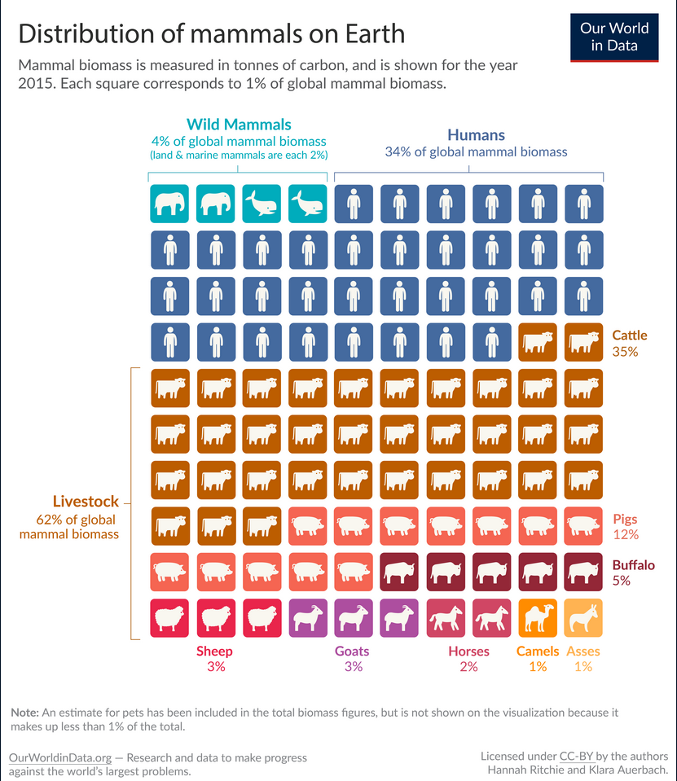 

Quelle: [Wild mammals make up only a few percent of the world’s mammals - Our World in Data](https://ourworldindata.org/wild-mammals-birds-biomass "Wild mammals make up only a few percent of the world’s mammals - Our World in Data") 

##
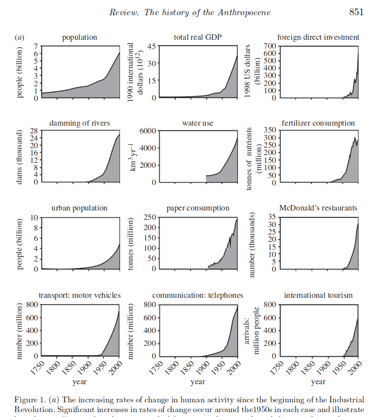

Quelle: @steffenAnthropoceneConceptualHistorical2011, p.851

##

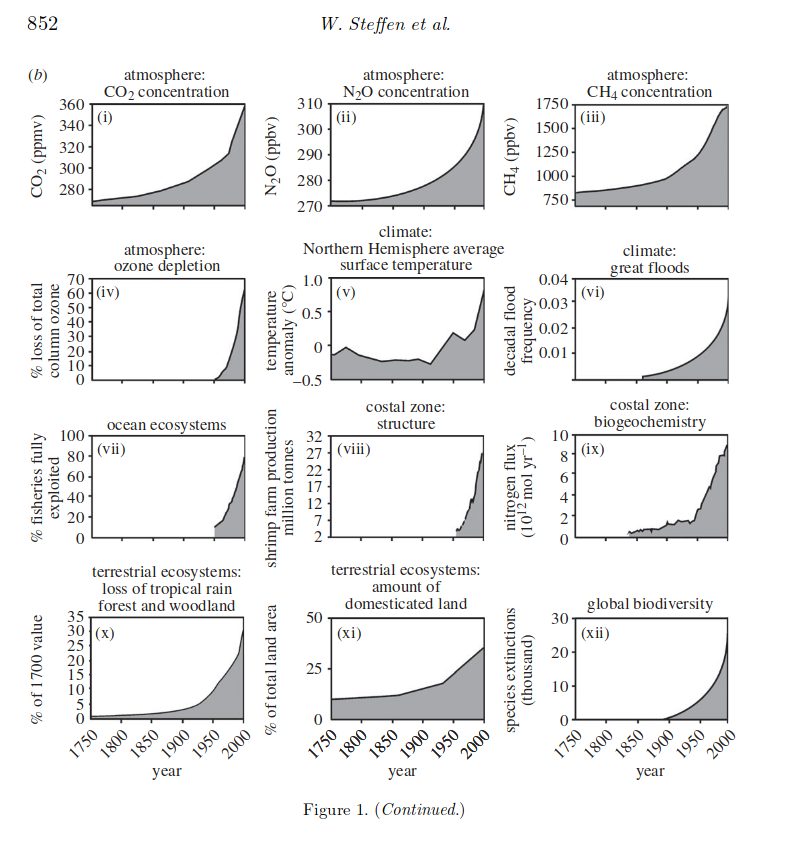

Quelle: @steffenAnthropoceneConceptualHistorical2011, p.852

##

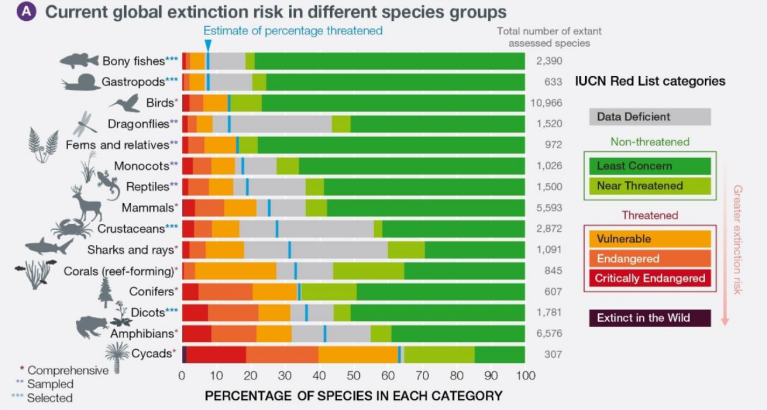

Quelle: @ipbesGlobalAssessmentReport2019, p. 

::: notes :::

Seit ungefähr 1950 haben sich diese stabilen Bedingungen des Holozän verändert. In der erdsystemwissenschaft wird oft von der großen Beschleunigung gesprochen. Eine Vielzahl von Kenngrößen sind nach oben gestellt, oft exponentiell. Einige dieser Kenngrößen betreffen die Menschheit, etwa die Zahl der Menschen die enorm gewachsen ist und die Wirtschaftsleistung Punkt andere betreffen die natürlichen Systeme, etwa die Nutzung des Bodens, den CO2 Gehalt der Atmosphäre und der Meere. Das gesamte Erdsystem hat sich dadurch verändert, am deutlichsten sichtbar in der temperatursteigerung die so ausgelöst wurde und auf die ich noch zu sprechen komme, aber auch an vielen anderen Parametern. In der Geologie wurde deshalb vorgeschlagen, von einer neuen erdgeschichtlichen Epoche zu sprechen, dem sogenannten anthropozän, vom griechischen Wort anthropos für den Menschen Punkt im anthropozän hat der Einfluss des Menschen auf die Erde Dimensionen erreicht, die den bisherigen geologischen Epochen vergleichbar sind Punkt ob sich ob dieser Begriff des anderen Prozent sich in der Wissenschaft durchsetzt in der Geologie durchsetzt ist noch nicht geklärt Punkt vieles spricht aber dafür. Für das Verstehen des erdsystems ist dieser Begriff jedenfalls sehr wichtig.

Eine der charakteristischen Eigenschaften des anthropozän ist es, dass die Masse der von Menschen produzierten Objekte enorm angestiegen ist. Dabei handelt es sich natürlich vor allem um Bauwerke und Infrastruktur, und hier wiederum vor allem um etau insgesamt hat die menschliche Infrastruktur inzwischen ein Gewicht, das größer ist, als das von allen Lebewesen zusammen. Pro Quadratmeter der Erdoberfläche beträgt es ungefähr 50 Kilo. Das ist eine der Rechtfertigungen dafür, von anthropozän zu sprechen, denn die Reste dieser Zivilisation werden auch noch in Millionen von Jahren, wenn die menschliche Geschichte längst aufgehört haben dürfte, das Gesicht der Erde prägen. Manche eher systemwissenschaftler sprechen von der technosphäre oder techno4 und stellen sie der biologischen Sphäre oder -4 gegenüber, dabei gibt es auch die Meinung, dass ich diese technosphäre genauso selbst regulieren wird wie die Biosphäre, wobei dann die Frage ist, ob die technosphäre dazu noch auf Dauer auf Menschen angewiesen ist. andere Wissenschaftler nennen die ganze Epoche nicht andere Prozent sondern capital Luzern und verstehen diese Infrastruktur als fixes Kapital und das ganze Wachsen der Infrastruktur als Teil der Akkumulation des Kapitals, also als Ergebnis des Kapitalismus für den charakteristisch ist das Kapital immer wieder weiteres Kapital erzeugt.

:::

## 7 Planetare Grenzen sind überschritten

 

Quelle: @rockstromSafeJustEarth2023 

::: notes :::

Ich habe schon gesagt, dass man in den erdsystemwissenschaften, die Zone in der es Leben gibt als ein sich selbst regulierendes System versteht Punkt in dieser Zone gibt es verschiedene Zyklen, die dafür sorgen dass sich das System als ganzes im Gleichgewicht erhält. Dazu gehört der kohlenstoffzyklus also das ist jedenfalls der wichtigere Teil, die Fotosynthese, die CO2 zu Sauerstoff verarbeitet während gleichzeitig die Pflanzen wachsen, wobei dann wiederum durch andere Prozesse das CO2 wieder in die Atmosphäre entweicht. Es gibt aber auch einen süßwasserzyklus und es gibt Zyklen für wichtige Nährstoffe, nämlich Stickstoff und Phosphor. Dieses System federt Ausschläge nach oben und unten immer wieder ab wenn innerhalb des erdsystems das CO2 etwas zu stark wird, dann entwickelt sich mehr Pflanzen und absorbieren dieses CO2. Es gibt aber Grenzen für diese Fähigkeit zur Selbstregulation, wie sie bei jedem sich selbst regulierenden System gibt. Wenn bestimmte Größen zu sehr ansteigen dann gibt das ganze System um oder erreicht andere Zustände. Vielleicht stabilisiert es sich auch überhaupt nicht mehr. diese Grenzen sind in den letzten Jahrzehnten intensiv erforscht werden Punkt viele Wissenschaftler sprechen hier von den sogenannten planetaren Belastungsgrenzen. Es gibt unterschiedliche versuche, diese Belastungsgrenzen zu erfassen. Einer der letzten dieser Versuche wurde jetzt gerade im Mai publiziert und zwar von der sogenannten Earth komischen das sind Wissenschaftler die von einer ganzen Reihe besonders renommierter Forschungsinstitute delegiert worden, um gemeinsam eine Bestandsaufnahme der Situation der Erde vorzulegen spricht von 8 planetaren Belastungsgrenzen, und geht bei sieben dieser Grenzen davon aus, dass sie bereits überschritten worden Punkt die Grenze für das Klima auf dass wir noch kommen, liegt übrigens bei einer temperatursteigerung von einem Grad. .

:::

## Verfehlen der Sustainable Development Goals
## 6. Massenaussterben
## Schutz der Biodiversität
## Klimakrise

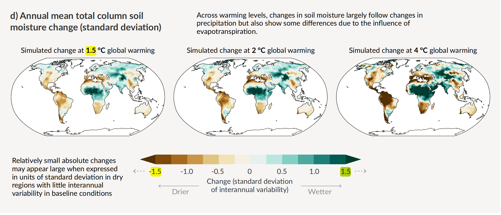

## Doughnut-Modell vs. Kapitalakkumulation
::: notes :::

Die Krisen über die wir jetzt lange gesprochen haben, haben viele ÖkonomInnen und Ökonomen dazu gebracht, alternative wirtschaftsmodelle zu entwickeln. Die Wirtschaftstheorie zu großen Teilen und die Wirtschaftspolitik ist bisher auf Wachstum ausgerichtet, dass durch das Bruttosozialprodukt gemessen wird Punkt dabei handelt es sich nicht nur um eine Messung von außen, sondern von dieser Kennzahl sind sehr viele Entscheidungen, zum Beispiel über Investitionen abhängig. Dieses wirtschaftsmodell berücksichtigt natürliche Ressourcen, ihre Grenzen und ihre Erschöpfung nicht, sondern geht grundsätzlich davon aus, dass ich dass diese Ressourcen entweder unendlich zur Verfügung stehen oder aber durch neue Technologien immer wieder Ersatz für sie geschaffen werden kann. Wir sehen das gerade in Deutschland bei der FDP und leider auch hier bei der ÖVP, wo immer wieder behauptet wird, man könne der Klimakrise mit sogenannten technischen Lösungen begegnen. Es gibt aber, natürliche Grenzen, die sich technisch nicht aus der Welt schaffen lassen, z.b die Grenzen der Belastung der Atmosphäre oder auch der Meere mit CO2. in den letzten Jahren hat sich als Alternative zu diesen linearen, wachstumsorientierten Modell vor allem ein Modell oder ein Bild eines Modells durchgesetzt, dass man oft Donut oder katzenmodell nennt. Zuerst vorgeschlagen hat es die englische Ökonomie Kate River. Gibt es den Teig, der in etwa der Zone entspricht, in der Menschen gut leben. Diese Zone hat eine innere oder untere und eine äußere oder obere Grenze die untere Grenze ist die einer nachhaltigen Entwicklung. Unterhalb dieser Grenze sind die Menschen so arm, dass sie kein menschenwürdiges Leben führen können. Die obere Grenze bilden die sogenannten planetaren Belastungsgrenzen, von denen wir schon gesprochen haben. Wenn diese Grenzen überschritten werden, dann ist das funktionieren des gesamten erdsystems gefährdet. Die neueste Publikation vieler Wissenschaftler zu den planetaren Belastungsgrenzen, die das Donut Modell integriert, geht davon aus, dass wir sieben von acht solcher bekannten Grenzen bereits überschritten haben. Wie dieses Donut umzusetzen ist, dafür gibt es sehr unterschiedliche Vorstellungen, aber das eine Umorientierung der Wirtschaft in dieser Richtung notwendig ist, daran gibt es keinen vernünftigen Zweifel. Man kann darüber streiten, ob Wirtschaftswachstum überhaupt mit diesem donut-modell vereinbar ist Punkt ich selbst glaube nicht, dass das der Fall ist. Die Donut Theorie selbst fordert aber nur, wie es heißt, Wachstums agnostisch zu sein, also nicht entscheiden zu müssen, ob unendliches Wirtschafts magst du möglich ist oder nicht. Entscheidend ist nur, dass das Wachstum nicht dazu führt, die Grenzen des erdsystems auf Dauer zu überschreiten.

Dieses Donut Modell ist als globales Modell entworfen worden, aber es wird bereits zunehmend auch in Städten und Regionen verwendet, konsequent z.b in Amsterdam. Wenn wir die lokale Problematik des Waldes hier in einem etwas größeren Kontext setzen, dann können wir überlegen, wie ein solches donut-modell in unserer Region aussehen würde. Auch dabei müssten wir uns überlegen, wie wir die Emissionen reduzieren können, wie wir umgekehrt für Ausgleich von Emissionen sorgen können, wie wir die Landwirtschaft so betreiben, dass ich noch mehr Stickstoff und Phosphor in die Umgebung entlassen wird wie die Gewässer in einem lebensfähigen Zustand erhalten werden können, und so weiter.

:::

# Alternativen bei uns (10')
## Klimakrise in Österreich und Adaption

::: notes :::

Die Klimakrise trifft unterschiedliche Gebete der Erde unterschiedlich stark. Insgesamt erhitzt sich die Luft über dem Festland schneller als über dem Meer, weil das mir ja für einen Ausgleich sorgt Punkt dazu kommt Gebiete, die weitervermehr der Fall entfernt sind sich schneller erhitzen und dass sich die polargebiete wiederum schneller erhitzen Punkt alles zusammen führt dazu dass die Klimakrise hier bei uns in Österreich deutlich gravierender ist, als in vielen anderen Gebieten Punkt schon jetzt liegt die temperatursteigerung bei uns bei über zwei Grad während sie im globalen Mittel nur 1,1 Grad beträgt. Frankreich, dass er nicht so weit entfernt ist, stellt sich gerade in den offiziellen Planungen auf eine temperatursteigerung von bis zu vier Grad ein , zu der ist dann kommen wird , wenn die Emissionen so wachsen, wie es den Zielsetzungen der verschiedenen Staaten der Erde im Augenblick entspricht. Die tatsächliche Entwicklung im Moment würde sogar zu noch hören temperatursteigerungen führen .

Die Folgen dieser Entwicklung haben wir in den letzten Jahren und auch in den letzten Monaten alle selbst erlebt. Schnee im Winter ist inzwischen zu einer Seltenheit geworden. In den Skigebieten konnte lange überhaupt nicht Ski gefahren werden. Im Sommer kommt es immer wieder zu trockenheiten und Hitzewellen. Das Wasser fehlt in vielen Gebieten, auch hier in der südlichen Steiermark. Insekten, die Krankheiten verbreiten, und bisher nur in den Tropen vorkam, werden jetzt auch bei uns heimisch, und so weiter Punkt es handelt sich um eine Veränderung der Umwelt, wie sie in der Geschichte Seite Eiszeit nie gegeben hat und diese Entwicklung ist auch bei uns erst am Anfang Punkt ein österreichischer mit der Urologe hat in einem Podcast gesagt, dass ich ihn um 20 50 auf Temperaturen wie ist mir einstellen muss und ist mir auf Temperaturen wie in Saudi Arabien.

Diese Entwicklung macht es in jedem Fall notwendig, sich anders veränderte Klima anzupassen. Dazu sind die bisherigen städtischen Strukturen oft nicht in der Lage. Graz stellt sich wie andere Städte gerade um Punkt man versucht in den Städten so viel grünraum wie möglich zu schaffen, und auch in der Umgebung von Städten wird es wichtig sein, durch so viel widerstandsfähige Vegetation wie nötig die Temperaturerhöhung in erträglichen Grenzen zu halten. Das wird vielleicht auch dazu führen, dass noch mehr Menschen lieber im Gebieten wohnen, in denen es noch so viel Vegetation gibt kommt, dass die Temperaturen nicht völlig unerträglich werden.

:::

## Biodiversitätskrise in Österreich und Sicherung von Ökosystemen

::: notes :::

Die biodiversitätskrise, über die wir eben global gesprochen haben, hat auch Österreich erfasst. Die Zahl der Insekten ist ähnlich drastisch zurückgegangen wie in Deutschland. Johannes gepp, der lange Präsident des naturschutzbundes Steiermark war, hat das mit vielen anderen detailliert verfolgt und sich immer wieder für die Erhaltung von Ökosystemen eingesetzt. Auch bei Vögeln Amphibien Reptilien und natürlich auch Säugetieren, ist es zu erheblichen Verlusten gekommen. Dass die Klimakrise zu dieser biodiversitätskrise erheblich beiträgt, haben wir eben schon erwähnt Punkt das gilt unter anderem für den Wald, es gilt für die Biodiversität in den Gewässern im alpinenraum, die sich nicht an die Erwerbung anpassen können, und es wird zunehmend für alle Arten in unserem alpinenraum gelten. Wenn man sich die Website von Christoph essl, den Träger des letzten für Universität Wissenschaftler des Jahres anschaut, der sich an der Universität mit Biodiversität beschäftigt, dann sieht man als eine der ersten Übungen einen Vergleich der Berg fauner und Flora in unserem Raum mit dem südlichen, weil wir hier die Umweltbedingungen des südlichen abnehmen haben werden, wenn sich die Klimakrise im erwartbaren Maße fortsetzt. Es gibt aber auch viele Grüße Hunde außerhalb der Klimakrise und, das können wir fast täglich in den Medien hören, die Zerstörung von naturräumen insbesondere durch die Versiegelung ist dabei ein Hauptgrund Punkt die größte Rolle spielen dabei neue Gebäude und Straßen, und um Straßen und Straßenbau handelt es sich ja auch bei dem Projekt um den und dass es hier geht. Aber auch Bergbau und dazu gehören spielen eine erhebliche Rolle insgesamt ist sehr viel Landfläche dadurch verloren gegangen.

Man muss aber andererseits auch sagen, dass die Ökosysteme hier in der Steiermark viel intakter sind als weiter nördlich ich kann das auch persönlich sagen: viele der Tiere und Pflanzen, die es hier gibt, kenne ich aus meiner Heimat Deutschland nicht mehr. Einer der Käfer, die es hier im Wald gibt, der alpenholzbock, ist extrem selten, scheint sich hier aber ohne große Schutzmaßnahmen bisher gehalten zu haben ähnliches gilt z.b für die Eisvögel. Wir haben hier noch eine relativ große Artenvielfalt, und damit haben wir auch Chancen, etwas für die Regenerierung der Artenvielfalt zu tun.

Ich muss jetzt an dieser Stelle noch einmal auf die Klimakrise zurückkommen und insbesondere auf die Maßnahmen zur Milderung der Klimakrise und zur Anpassung. Bei diesen Maßnahmen spielen die Erhaltung von natürlichen Gebieten eine wichtige Rolle. Wälder, wenn sie noch natürlich oder wenigstens halbwegs intakt sind nehmen große Mengen von CO2 auf. Damit sind sie eine sogenannte natürliche Senke und kompensieren den CO2-Ausstoß, der sich nicht vermeiden lässt. Jeder Eingriff in einen Wald vergrößert die Folgen des CO2 ist das ausgestoßen wird, und über dies führt in der Regel dann auch selbst zu CO2 Emissionen sowohl durch die Biomasse die dabei vernichtet wird als auch meist durch die Infrastruktur die neu errichtet wird. Genauso wichtig wie für die die für den Klimaschutz, also die sogenannte Meditation, sind Waldgebiete aber auch für die Anpassung an den sogenannten Klimawandel Punkt ist sie verdunsten sehr große Mengen von Wasser, sie halten auch große Menge von Wasser, und dadurch senken sie die Temperaturen Punkt das wird in den kommenden Jahren notwendig sein. Jeder Eingriff in einen Waldgebiet für dazu dass die lokalen Temperaturen in der Nähe weiter steigen.

:::

## Lokale Resilienz

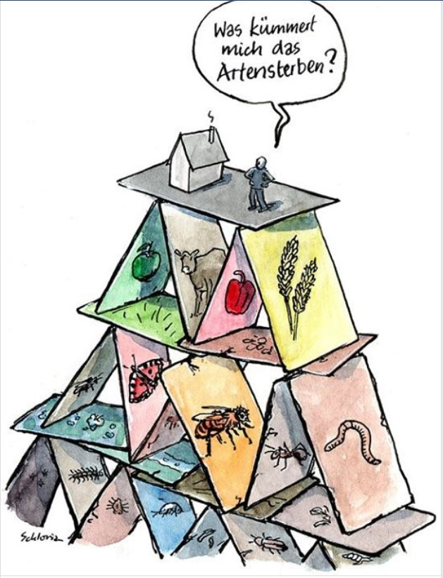

::: notes :::

Wir haben mit dem Gegensatz von Wald und schottergrube begonnen, und jetzt möchten wir auch wieder darauf zurückkommen. Es gibt wie wir gesehen haben, viele Gründe aufgrund der globalen Situation und der Situation in Österreich insgesamt, auf Projekte zu verzichten, die für die ökologischen Systeme, in denen wir leben große Nachteile bedeuten, und Vorteile vor allem für die bieten Komma die jetzt schon Kapital haben und es einsetzen können. Die Frage ist aber, ob auch über diese globale und wenn man so will auch ethische Dimension hinaus es nicht wirklich sehr konkrete Gründe gibt, sich für die Erhaltung eines funktionierenden waldgebiets einzusetzen. Würde sagen, dass diese Gründe zu einem Entwicklungskonzept für eine Region in der Nähe einer relativ großen stark wie Graz gehören. Wir haben schon gesehen, Artensterben und klimakrise eng verbunden sind mit den Prozessen der Organisierung, und auch hier in Graz und in seinem Umland haben wir es mit einem sehr schnellen organisierungsprozess zu tun. Dieser Prozess stößt an Grenzen, und die Frage ist jetzt: wie entwickeln wir uns weiter. 

Dabei müssen wir einerseits berücksichtigen, wie sich die Situation insgesamt verändert. Wenn sich die Wände in der wirtschafts- und Energiepolitik, die in Europa begonnen hat, wirklich durchsetzt dann liegt auch für eine einzelne Gemeinde die Zukunft nicht in noch mehr ökologisch schädlichem Wachstum, sondern eher darin, die Chancen wahrzunehmen, die dieser , bis auf europäischer Ebene ja auch heißt green Deal, für uns konkret bedeutet. Diese Chancen liegen im Aufbau von wirtschafts- und Lebensformen, die mit der Natur verträglich und attraktiv sind. Ob auf Dauer weiter so gebaut wird wie in den letzten Jahren, ob also, um es konkret zu sagen auf Dauer weiter Unmengen von Schotter abgebaut werden müssen, statt vorhandenes Material zu recyceln, ist ja fraglich. Es ist aber umgekehrt sehr wahrscheinlich, dass immer mehr Menschen natural Verhältnisse suchen werden und sich gerne in einer Region aufhalten, die durch die Beiträge der Natur von den schlimmsten Folgen der ökologischen Krisen geschützt ist und vielleicht sogar etwas dazu beiträgt, gegen diese Folgen anzugehen.

Stellt sich dann auch die Frage, wie sieht es eigentlich mit unserer Identität, neoliberal formuliert mit unserer Marke in einer Region wie dieser hier aus: wollen wir, diese Region sich immer mehr zu einer Art Vorstadt entwickelt die weder ländlich noch städtisch ist und auch wieder die Vorteile des Landes noch der Stadt bietet, oder wollen wir, um sozusagen, uns als eine Art grüne Region oder kleinregion präsentieren, die auch deutlich als solche erkennbar ist Punkt und für die Entwicklung einer solchen Marke sind solche Projekte ebenso Gift, wie für die Umwelt, die sie zerstören. Neue Zeile

Schließlich spielt auch hier auf der lokalen Ebene die globale und ethische Dimension eine Rolle. Weiter zu den Zerstörungen beizutragen, die zum sechsten massenaussterben und zur Klimakrise geführt hat, tut auch etwas, mit den Menschen, die daran im kleinen beteiligt sind, es macht sie zynisch, und es zwingt sie und es wird sie immer mehr zwingen, ihren Kindern und Enkeln zu erklären, weil warum sie an diesen Prozessen mitgewirkt haben. Wir glauben, dass es auch für die Gemeinschaft, die hier lebt, und den Umgang der Menschen nicht nur mit der Natur, sondern auch miteinander, besser ist, wenn ihr alle sagen können, wir wollen Teil einer regenerativen Zukunft sein, und nicht der weiteren Zerstörung

:::

<!-- 

# Was bedeutet die Artenvielfalt für uns?

## Das Leben hat die Erde gestaltet

::: notes :::
Blauer Planet
:::

## Wir hängen vom Leben ab

::: notes :::

Wir können nicht ohne die Biosphäre überleben. 

:::

## Ohne Artenvielfalt keine Gesundheit

# Artenvielfalt im Anthropozän
## Urbanisierung
## Intensivlandschaft
## Kolonisierung
## Kapitallogik versus Zusammenleben

# Das Klima verändert sich zu schnell
## Das Tempo der globalen Erhitzung
## Gefahr für die Verteilung der Arten auf der Erde
## Die Klimakatastrophe kommt nicht allein
## Zerstörte Ökosysteme

# Das sechste Massenaussterben
## Artensterben jetzt und in der Erdgeschichte
## Veränderungen in der Biomasse
## Verschwinden der Insekten
## Verschwinden der Vögel
## Verschwinden von Boden- und Mikroorganismen
## Drohender Kollaps

# Klimakrise und Artensterben in Österreich
## Gletscher und Wasser
## Wald und Böden
## Versiegelung
## Veränderungen in den Städten

# Revolution für das Leben
## Ist es schon zu spät?
## Artenvielfalt als Schutz vor der ökologischen Krise
## Wettlauf von Klimakrise und Anpassung
## Lokale Bündnisse gegen globales Kapital
## Selbstorganisation in Dörfern und Städten

# Worauf können wir uns berufen?
## Internationales Recht
## Recht in Österreich

# Wo kann ich mich informieren?
## Bücher und Websites
## Österreichischer Biodiversitätsrat
## NGOs

-->
