

# Klimakrise, Artensterben  - global denken, lokal handeln

## Wer sind wir?

{.portrait}

{.portrait}
{.portrait}

# Wald vs. Kiesgrube 
##

{width=70%}

##

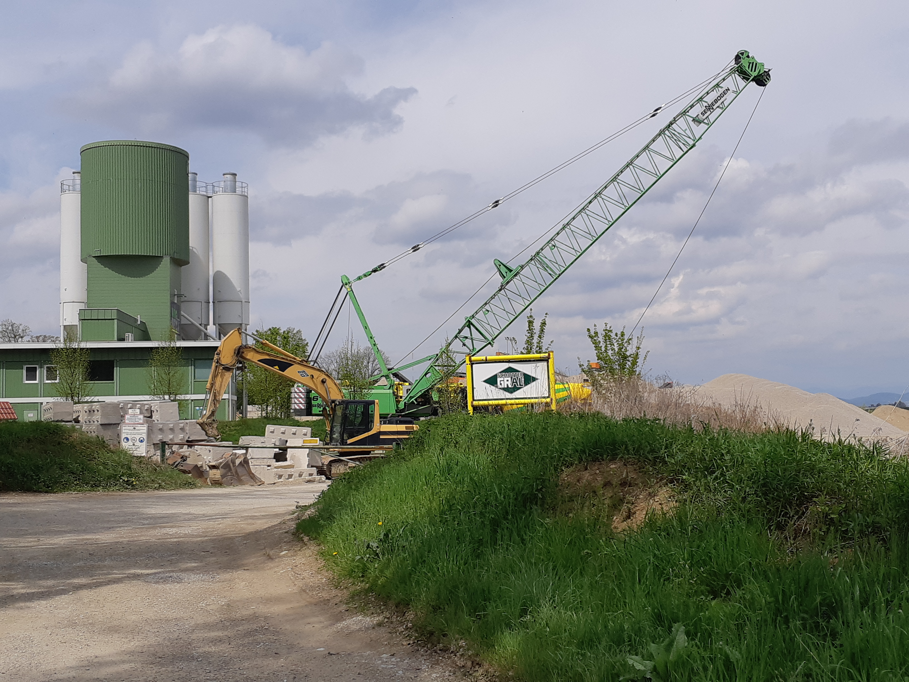{width=70%}

## 

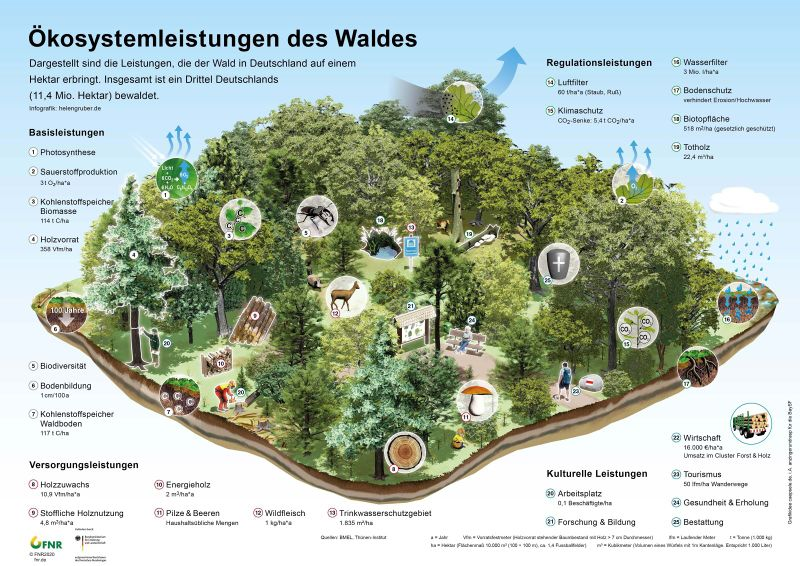{width=85%}

Quelle: Fachagentur Nachwachsende Rohstoffe e.V. (FNR) (2021). Via: <https://wiki.bildungsserver.de/klimawandel/index.php/Datei:D_%C3%96kosystemleistung_Wald.jpg>

##

Quelle: @eisenmengerRessourcennutzungOesterreich20202020, p. 34

##

> Das weltweite Bevölkerungswachstum und die damit verbundene voranschreitende Urbanisierung fordern immer größere Mengen an Baustoffen, wie Beton oder Asphalt. Für die Herstellung dieser bedarf es in einem großen Umfang Bausande, -kiese und Schotter. 

##

> Wie die Statistik verdeutlicht, wird die Produktionsmenge bis zum Jahr 2022 in nahezu sämtlichen Ländern, die abgebildet wurden, ansteigen. Diese Entwicklung verdeutlicht die global immer weiter ansteigende Nachfrage nach den unscheinbaren Rohstoffen.

Quelle: @bundesverbandbaustoffe-steineunderdene.v.BBSZahlenspiegel20222022

## Fragmentierung der Natur und Zersiedelung

##

Quelle: @sudhakarreddyBiodiversityCharacterisationLandscape2011 

##

{width=70%}

© Christoph Grill. Quelle: @grillWindthrowSpring2022 

##
{width=70%}

[Die Steiermark verliert den Boden unter den Füßen – DATABLOG](http://datablog.fh-joanneum.at/2020/die-steiermark-verliert-den-boden-unter-den-fuessen/ "Die Steiermark verliert den Boden unter den Füßen – DATABLOG")

##

Bevölkerungsentwicklung Wundschuh
 

Quelle: [Wundschuh – Wikipedia](https://de.wikipedia.org/wiki/Wundschuh "Wundschuh – Wikipedia") 

##
{width=70%}

Quelle: [Wundschuh - RiS-Kommunal - Startseite - Umwelt und Wohnen - Flächenwidmungsplan](http://www.wundschuh.at/Umwelt_und_Wohnen/Flaechenwidmungsplan "Wundschuh - RiS-Kommunal - Startseite - Umwelt und Wohnen - Flächenwidmungsplan")

 
<https://www.google.com/maps/@46.9147714,15.466161,789m/data=!3m1!1e3?hl=de&entry=ttu>

# Planetare Grenzen

##
{width=60%} 

Quelle: @steffenAnthropoceneConceptualHistorical2011, p.851

##

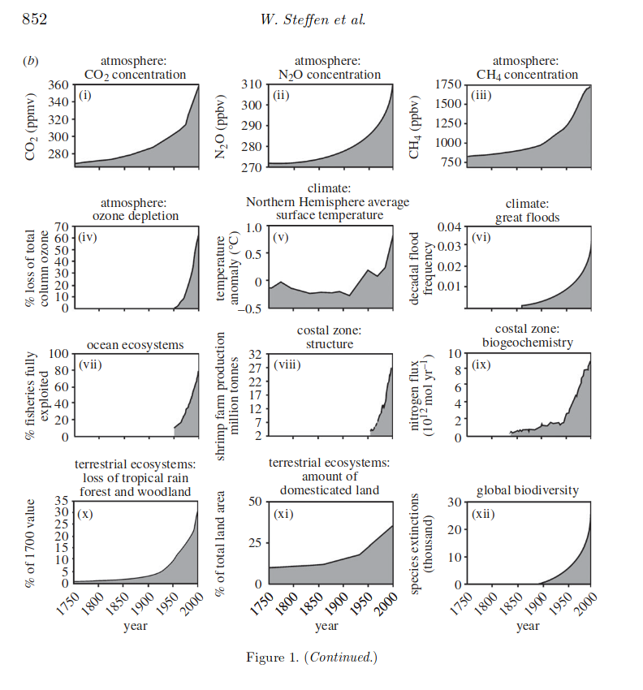{width=60%}

Quelle: @steffenAnthropoceneConceptualHistorical2011, p.852

##

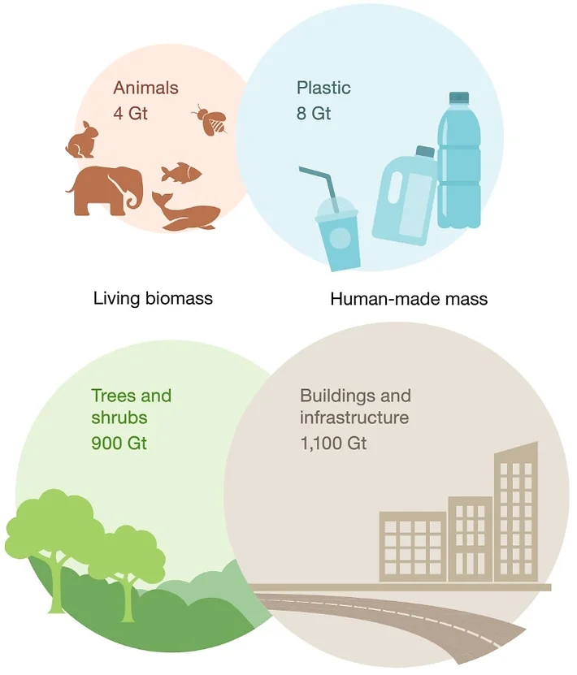{width=50%} 

Quelle: @elhachamGlobalHumanmadeMass2020

##

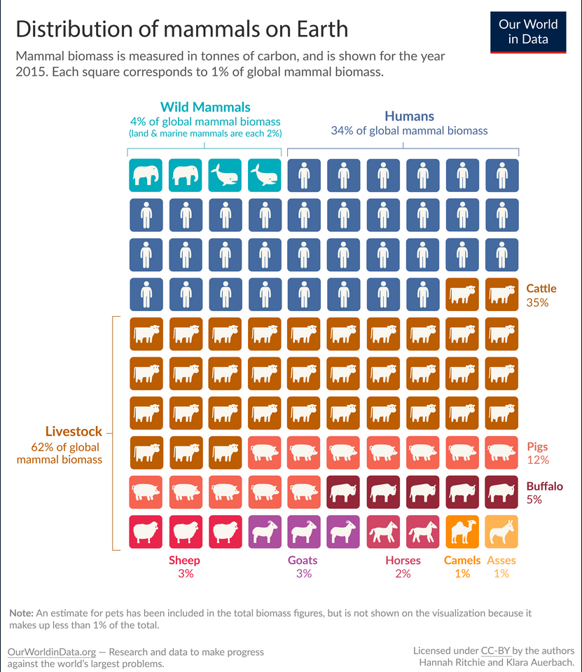{width=50%} 

Quelle: [Wild mammals make up only a few percent of the world’s mammals - Our World in Data](https://ourworldindata.org/wild-mammals-birds-biomass "Wild mammals make up only a few percent of the world’s mammals - Our World in Data") 

##

Quelle: @ipbesGlobalAssessmentReport2019

## 

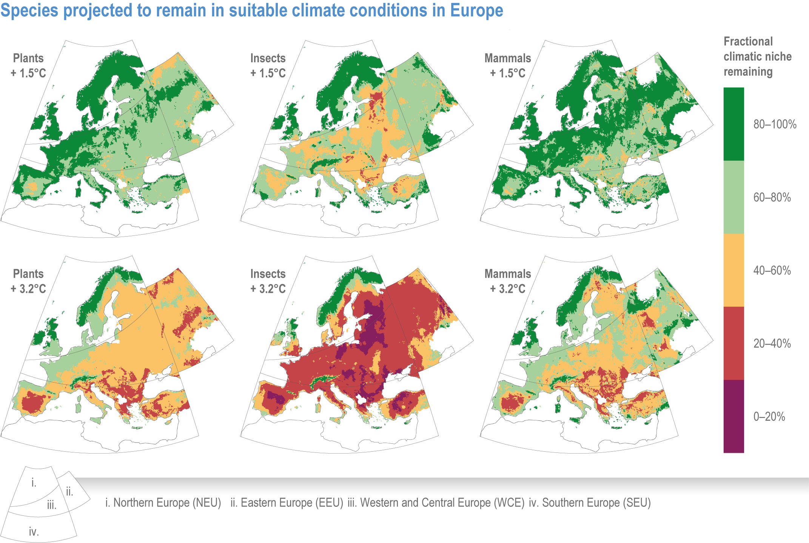{width=90%}

Quelle: @bednar-friedlEurope2022, Figure 13.9

## 

@ipccSummaryPolicymakers2021, Figure 5

## 

 

Quelle: @rockstromSafeJustEarth2023 

# Lokal handeln

## 

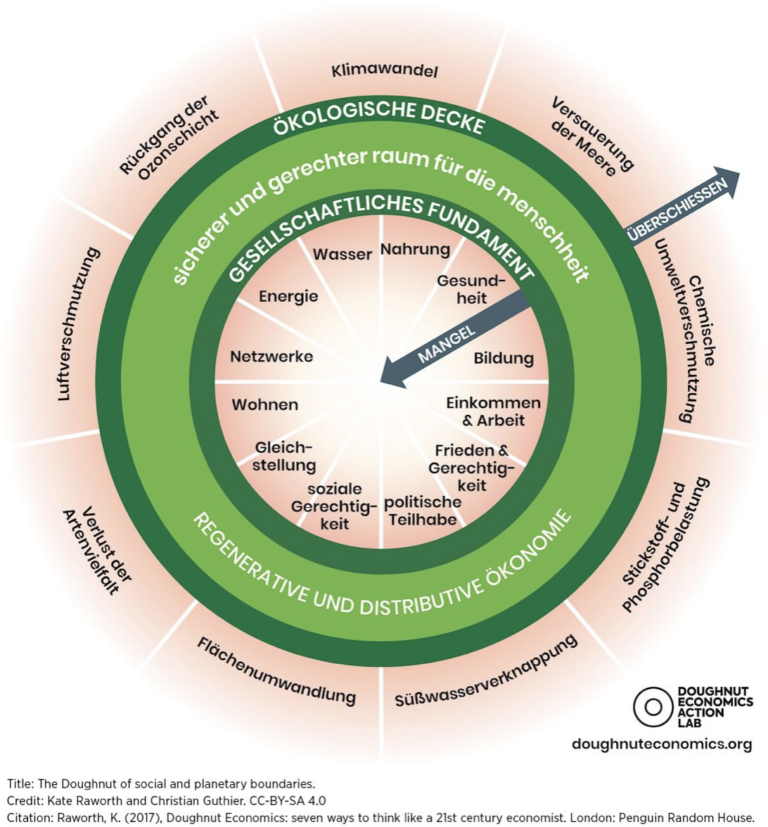{width=70%}

## 

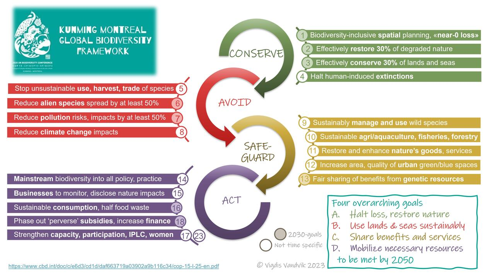

Quelle: @vandvikCheatSheetKunmingMontreal2023

##

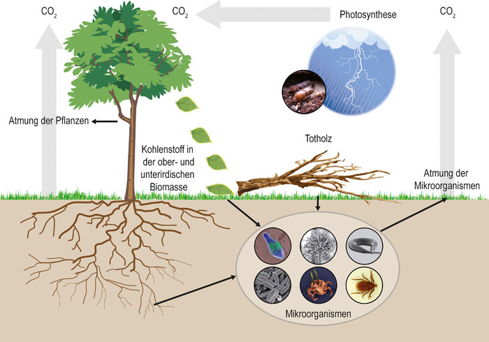

Quelle: @WaldAlsKohlenstoffsenke

##

> **Faustformel**: Ein Hektar Wald “speichert” pro Jahr über alle Altersklassen hinweg ca. 6 Tonnen CO2. Ein Festmeter bzw. ein Kubikmeter Holz hat rund 1 Tonne CO2 “gespeichert”. (Der Begriff “speichern” ist chemisch nicht richtig – siehe Fotosynthese). 

Quelle: [Wie viel Kohlendioxid (CO2) speichert der Wald bzw. ein Baum](https://www.wald.de/waldwissen/wie-viel-kohlendioxid-co2-speichert-der-wald-bzw-ein-baum/ "Wie viel Kohlendioxid (CO2) speichert der Wald bzw. ein Baum") 

## 

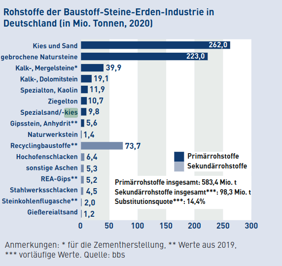

Quelle: @bundesverbandbaustoffe-steineunderdene.v.BBSZahlenspiegel20222022

##

> Die Projektionen zeigen, dass große Maßnahmen gefordert sind; es müssten alle bisher bekannten Optionen ausgeschöpft werden. Gut die Hälfte des Ressourcenverbrauchs sind nicht-metallische Mineralstoffe, die für den Aufbau und Erhalt unserer Bestände verwendet werden. [...] Würden wir also unsere Bestände verändern, könnten wir den Verbrauch der nicht-metallischen Mineralstoffe reduzieren. 

##

> Laut dem Weltklimarat gehen drei Milliarden Tonnen CO2 jährlich allein auf die Produktion von Zement zurück. Das sind bis zu zehn Prozent des vom Menschen ausgestoßenen Treibhausgases. Die Welt müsste weg vom Beton und das schnell. Das Gegenteil ist der Fall. [...] Die Welt ist so süchtig nach Beton wie nie zuvor. 

Quelle: [Klimasünder Beton - Ein Baustoff sucht Nachfolger](https://www.deutschlandfunk.de/klimasuender-beton-ein-baustoff-sucht-nachfolger-100.html "Klimasünder Beton - Ein Baustoff sucht Nachfolger") 

## 

{width=50%}

##

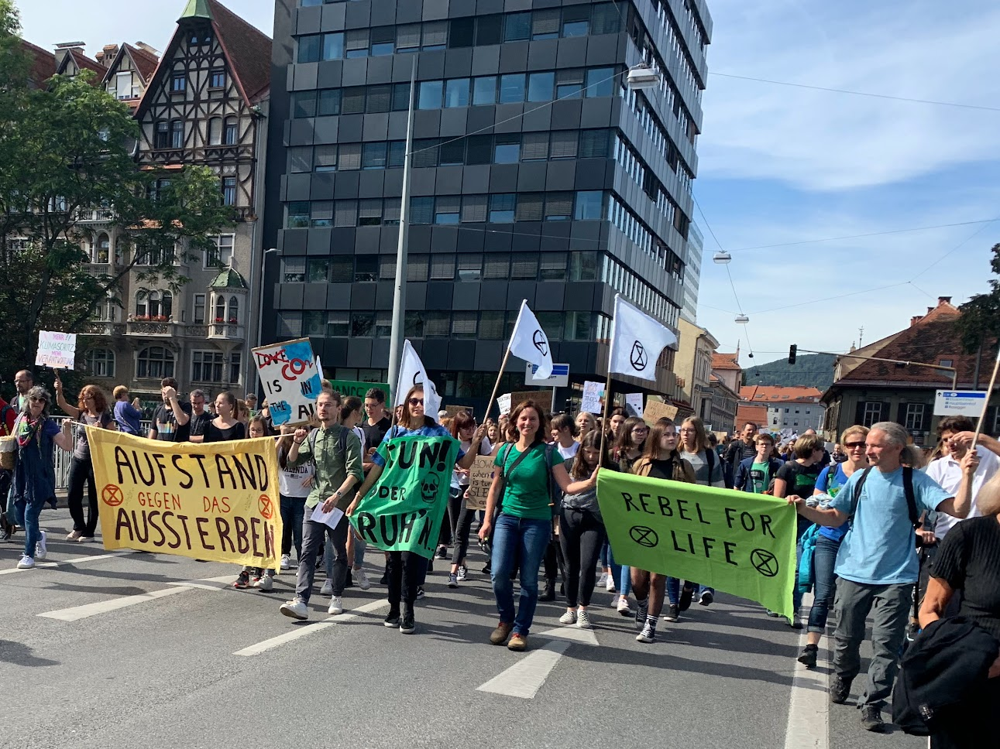{width=70%}

## Quellen